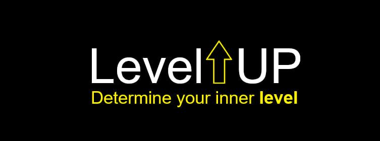

# Welcome to `LevelUp` org. 
### We are `LevelUp`, our company based in **Moscow, Russia**. We are making `Discord` bot for servers with `Epic Games` and `Steam` integration. Now we are looking for investions from all over the world! If **you** want to join our team send your cv to *levelupbilling@outlook.com*

## Main project:
+ `LevelUp` discord bot - is our main project for now, it is a powerful **all-in-one** bot with game statistics tracking and add-onable pluggins, currently we are making integrations with `Steam`, `Epic Games` and `ChatGPT`

# Tech stack:
+ **Development:**
> `Node.js`
> `TypeScript`
> `JavaScript`
> `Express`
> `Nest.js`
> `React`
> `StyleX`
> `Mongodb`
> `Mongooose`
> `Redis`
> `JWT`
> `RabbitMQ`
> `Python 3.11`
> `Pandas`
> `Flask`

+ **Deployment:**
>`GitHub actions`
>`Ubuntu server`
>`PM-2`
>`Docker`
>`Docker-compose`
>`Datadog`
>`Lazydocker`
---
## ***Wanna join us?***
**Hit our contacts below:**
> levelupbilling@outlook.com

+ You can send your *CV* or *GitHub* account link to us

---
### Partnership - (Telegram) https://t.me/IIIIIIIIIIIIIIIIIlIIIIIIIIIIIIII *or hit our email*
